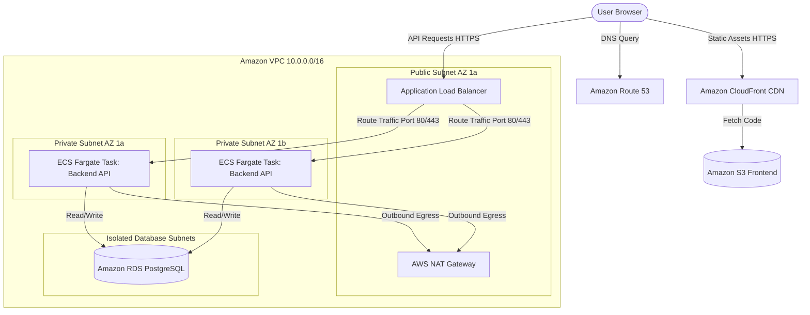

# Hello, I'm Daniele Gattoni

I'm an **AWS Cloud Systems Engineer** with a background in **Embedded Firmware** and **Industrial Automation** Engineering.

I've transitioned my core expertise toward designing secure, highly available cloud architectures in **Amazon Web Services (AWS)**, as its ecosystem provides the perfect intersection for my interests in core software development, automated physical devices, and remote control systems. As far as I do like the command line, I approach all infrastructure deployment via **Infrastructure as Code (Terraform)**.  
An important part of my work will be into **IoT**, **IIoT** and **Edge Computing**, bridging the gap between Operational Technology (OT) and Information Technology (IT) in the cloud.

## Featured Projects

Infrastructure & Automation: HashiCorp Terraform (IaC) [Prog.1], AWS CLI, Git, GitHub Actions (CI/CD).Networking & Protection: Amazon VPC [Prog.1], AWS NAT Gateway [Prog.1], Application Load Balancer (ALB) [Prog.1], AWS Certificate Manager (ACM) [Prog.1].Frontend Ecosystem: React, TypeScript, Amazon S3 (Static Hosting) [Prog.1], Amazon CloudFront (CDN) [Prog.1].Backend & Containerization: Docker, Amazon ECS Fargate [Prog.1], Amazon ECR, Node.js / Python API [Prog.1].Data & Domain Management: Amazon RDS (PostgreSQL) [Prog.1], Amazon Route 53 (DNS) [Prog.1].

**Enterprise Multi-Tier Web Platform** (In Development)  
A production-grade, highly-available full-stack web platform designed to demonstrate modern enterprise infrastructure engineering and secure application hosting on AWS  
* **Cloud & IaC**: Multi-AZ high-availability architecture orchestrated entirely via Terraform with strict network isolation using custom VPC subnets and NAT Gateways
* **Front-end & Back-end**: Responsive React (TypeScript) dashboard deployed globally via Amazon CloudFront CDN, connected to a containerized Node.js/Python API running on AWS ECS Fargate
* **Data Tier**: Fully managed Amazon RDS PostgreSQL database securely isolated inside private subnets with dynamic multi-AZ storage replication
* **Repository Link**

### AWS IoT Greengrass Smart Gateway (Planned)
An architecture focused on Edge Computing for industrial scenarios, ensuring low-latency data processing and operational continuity even during internet outages.
*   **Technologies:** AWS IoT Greengrass, Docker, Python (OPC UA / MQTT Client), IAM Policies.
*   👉 **[Link to Repository](You will add the link here in the future)**

---

